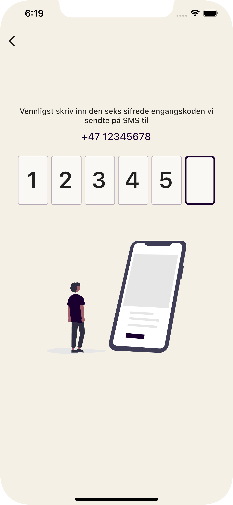
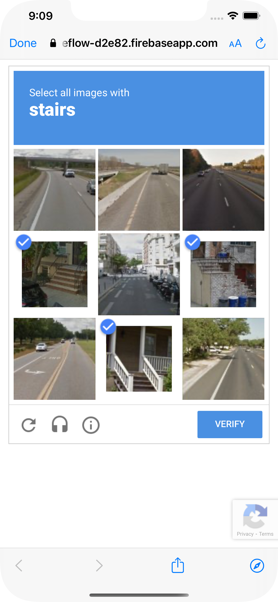
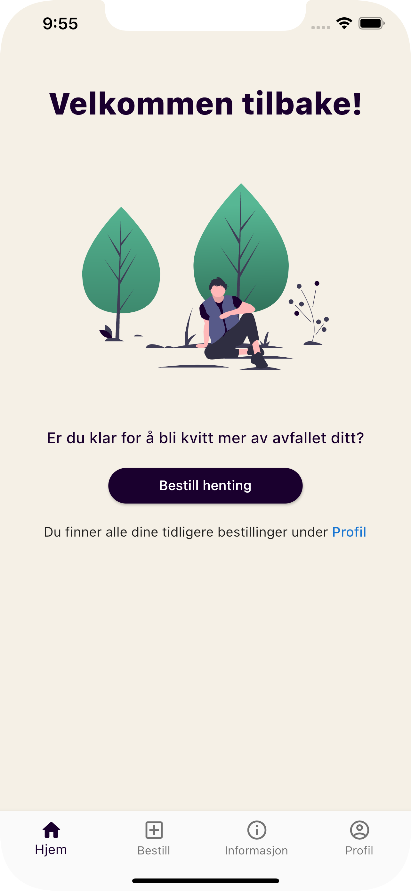
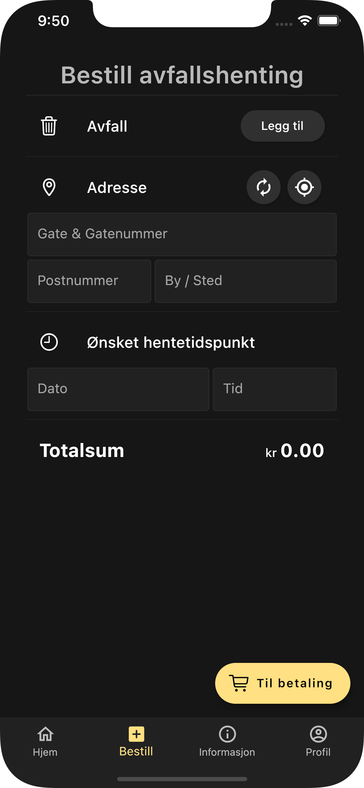
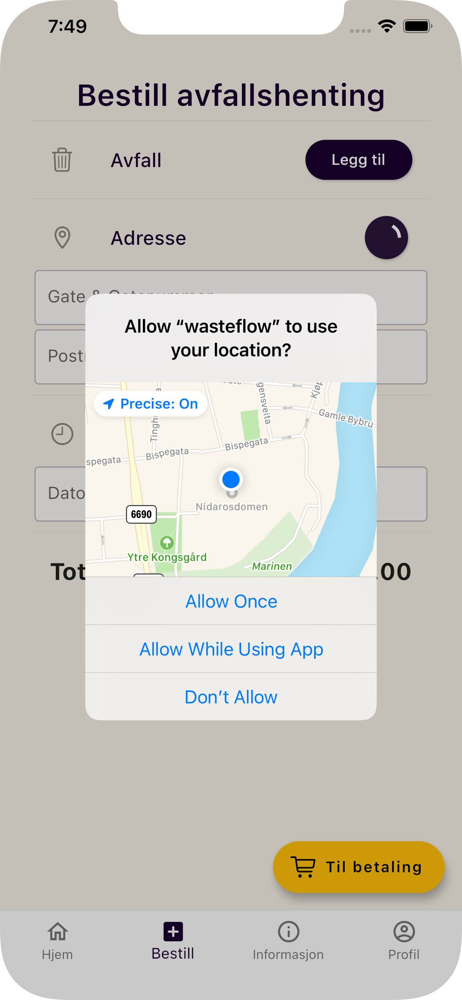
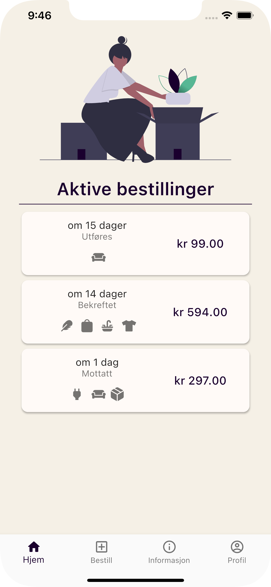
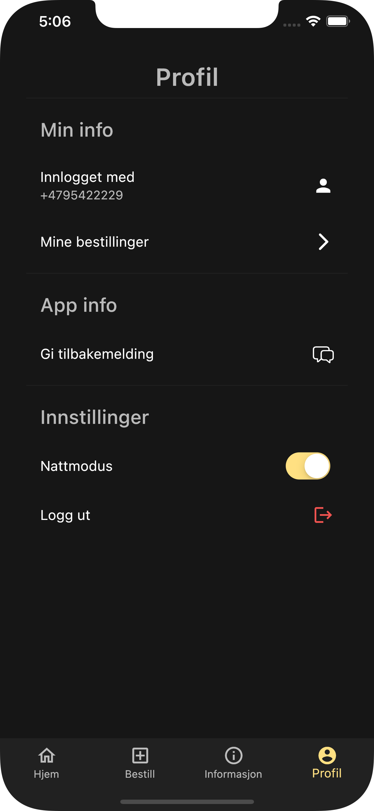
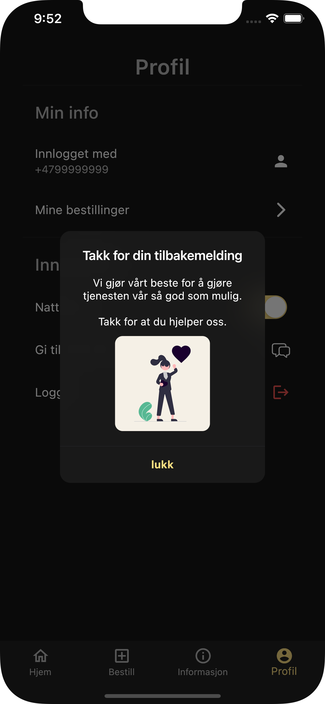

# Bachelor Project Demo

> Group Project with [Sabine Seljeseth](https://github.com/seljeseth)

Cross-platform mobile application to order pickup of waste in Norway. Developed with Flutter amd includes:

- SMS-verification
- User-authentication
- Location
- Live data from a database
- Dark Mode
- Feedback
- and more...

  
  
  
  
  
  
  
  
  

